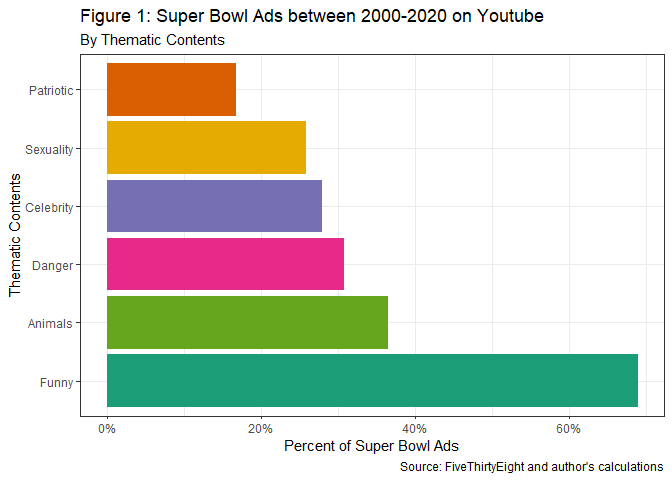
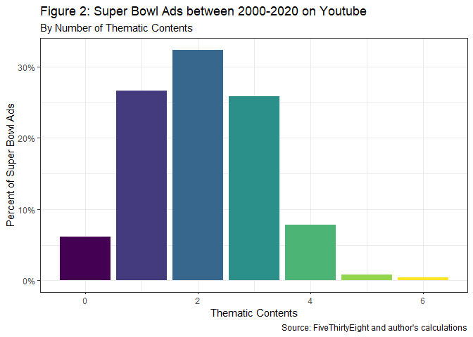
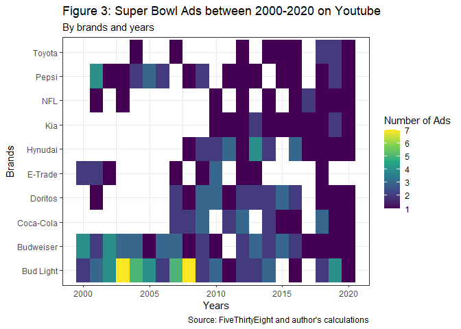
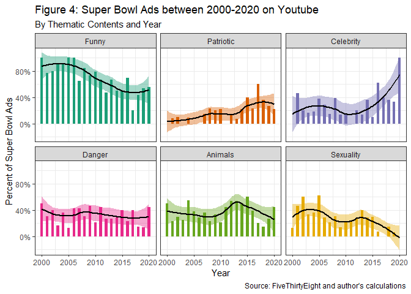
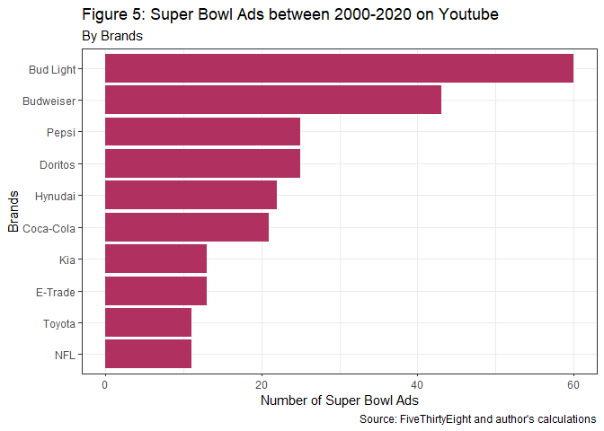
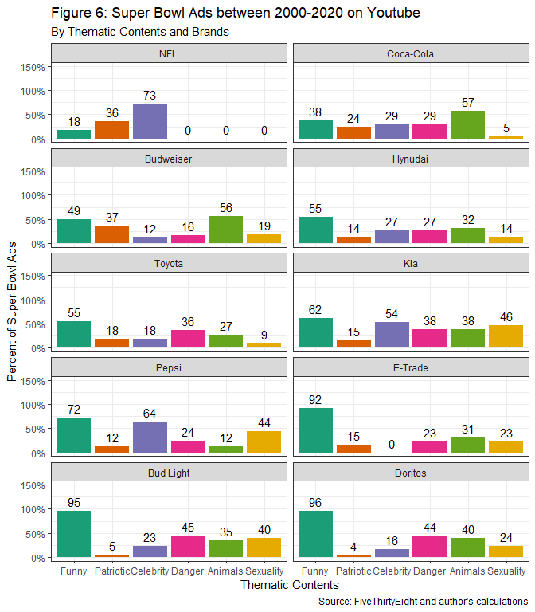

Thematic Contents in Super Bowl Ads Among Top 10 Brands on Youtube
================
Thao Tran

## Introduction

In this report, we examine thematic contents represented in the Super
Bowl Ads among top 10 brands between 2000 and 2020 on Youtube. It has
been suggested that 50% of the Super Bowl audience watches for the ads
alone (Forbes). Advertisers recognize the profits that they can make
from this audience of more than 100 million viewers (Statista); the ad
revenue for the 2021 Super Bowl reached a new high of 485 million USD,
and the average cost of a 30 second slot was estimated to be 6.5 million
USD (Statista). This price has increased rapidly in the past two
decades. As advertisers invest massive sums in short time slots, the ads
that they create concisely illustrate the values, images, and people
that they imagine will appeal to the American audience. An analysis of
the thematic contents of these ads privide great insights into the
current high stakes commercialist interpretation of American culture.

## Super Bowl Ads Data

The dataset comes from superbowl-ads.com and was collected by
FiveThirtyEight. It contains a list of ads from the 10 brands that had
the most advertisements in Super Bowls from 2000 to 2020, with matching
videos found on YouTube. In summary, our dataset contains 25 variables
and 247 rows of data values. After data cleaning, 244 ads were observed
and all of the ads observed were assessed by six specific criteria:
`funny`, `patriotic`, `celebrity`, `danger`, `animals` and `use_sex`.

``` r
# provide summary statistics
skim(youtube %>% select(year,brand,Funny,Patriotic,Celebrity,Danger,Animals,Sexuality))
```

|                                                  |           |
|:-------------------------------------------------|:----------|
| Name                                             | %&gt;%(…) |
| Number of rows                                   | 244       |
| Number of columns                                | 8         |
| \_\_\_\_\_\_\_\_\_\_\_\_\_\_\_\_\_\_\_\_\_\_\_   |           |
| Column type frequency:                           |           |
| factor                                           | 1         |
| logical                                          | 6         |
| numeric                                          | 1         |
| \_\_\_\_\_\_\_\_\_\_\_\_\_\_\_\_\_\_\_\_\_\_\_\_ |           |
| Group variables                                  | None      |

Data summary

**Variable type: factor**

| skim\_variable | n\_missing | complete\_rate | ordered | n\_unique | top\_counts                        |
|:---------------|-----------:|---------------:|:--------|----------:|:-----------------------------------|
| brand          |          0 |              1 | FALSE   |        10 | Bud: 60, Bud: 43, Dor: 25, Pep: 25 |

**Variable type: logical**

| skim\_variable | n\_missing | complete\_rate | mean | count             |
|:---------------|-----------:|---------------:|-----:|:------------------|
| Funny          |          0 |              1 | 0.69 | TRU: 168, FAL: 76 |
| Patriotic      |          0 |              1 | 0.17 | FAL: 203, TRU: 41 |
| Celebrity      |          0 |              1 | 0.28 | FAL: 176, TRU: 68 |
| Danger         |          0 |              1 | 0.31 | FAL: 169, TRU: 75 |
| Animals        |          0 |              1 | 0.36 | FAL: 155, TRU: 89 |
| Sexuality      |          0 |              1 | 0.26 | FAL: 181, TRU: 63 |

**Variable type: numeric**

| skim\_variable | n\_missing | complete\_rate |    mean |   sd |   p0 |  p25 |  p50 |  p75 | p100 | hist  |
|:---------------|-----------:|---------------:|--------:|-----:|-----:|-----:|-----:|-----:|-----:|:------|
| year           |          0 |              1 | 2010.25 | 5.87 | 2000 | 2005 | 2010 | 2015 | 2020 | ▇▆▇▇▆ |

The six thematic contents of interest were provided in the data as a
binary variable, indicating whether a theme or component is included in
the ads. The analysis is vulnerable to the limitations in regards to the
definitions and creations of these thematic contents variable. The
variable `funny` indicates whether an ad contains humor, `patriotic`
identifies ads with patriotic components, `celebrity` identifies ads
with celebrity appearance, `danger` identifies ads with dangerous
components, `animals` identifies ads with animal appearance, and
`use_sex` indicates if an ad uses sexuality. In particular, humor is the
most common theme, appearing in more than two-thirds of the top Super
Bowls ads in the past two decades, followed by animals and danger
(Figure 1). Patriotic component is the least represented themes,
included in only 17 percent of the ads.

``` r
# plot number of ads for each thematic contents 
youtube %>% select(brand,Funny,Patriotic,Celebrity,Danger,Animals,Sexuality ) %>% summarise_all(mean) %>% melt(id.vars="brand") %>%
  ggplot(aes(x = value, y= reorder(variable,-value),fill=variable))+
  geom_col() +
  theme_bw()+
  labs(
    title="Figure 1: Super Bowl Ads between 2000-2020 on Youtube",
    subtitle = "By Thematic Contents",
    x = "Percent of Super Bowl Ads",
    y = "Thematic Contents",
    caption = "Source: FiveThirtyEight and author's calculations"
  )+
  theme(
    legend.position = "none"
  )+
  scale_x_continuous(labels = scales::percent)+ 
  scale_fill_brewer(palette="Dark2")
```

<!-- -->

An ad can have one or more of these components or even none of the six
thematic contents we consider in our analysis (Figure 2). In fact, there
is one ad by Bud light in 2013 that includes all six thematic contents.
Approximately six percent of the ads does not include any of thematic
contents of interest and the median number of thematic contents in an ad
is 2, accounting for a third of the Super Bowl ads.

``` r
# number of themes in ads 
youtube %>% mutate(n_themes = Funny+Patriotic+Celebrity+Danger+Animals+Sexuality) %>% group_by(n_themes) %>% count()%>% mutate(share = n/dim(youtube)[1]) %>%
  ggplot(aes(y = share, x = n_themes, fill = n_themes)) +
  geom_col() +
  #geom_text(aes(label = share),vjust=0)+
  theme_bw()+
  labs(
    title="Figure 2: Super Bowl Ads between 2000-2020 on Youtube",
    subtitle = "By Number of Thematic Contents",
    y = "Percent of Super Bowl Ads",
    x = "Thematic Contents",
    caption = "Source: FiveThirtyEight and author's calculations"
  )+
  theme(
    legend.position = "none"
  )+ 
  scale_y_continuous(labels = scales::percent)+ 
  scale_fill_continuous(type = "viridis")
```

<!-- -->

We are interested in the variation in thematic contents of Super Bowl
ads in two dimensions: years and brands. However, it is important to
note that the observations are not balanced across brands and year
dimension. There are brands only exist in the data for several years and
and there are brands have multiple ads per year. The figure below
portrays the inconsistency across brands and years dimension in the
data.

``` r
# plot number of obs along the year and brand dimension 
youtube %>% group_by(year,brand) %>% count() %>%
  ggplot(aes(x = year, y = brand,fill=n)) +
  geom_tile()+
  labs(
    title = "Figure 3: Super Bowl Ads between 2000-2020 on Youtube",
    subtitle = "By brands and years",
    y = "Brands",
    x = "Years",
    fill = "Number of Ads",
    caption = "Source: FiveThirtyEight and author's calculations"
  )+
  theme_bw()+ 
  scale_fill_continuous(type = "viridis")
```

<!-- -->

## Variation in Thematic Contents on Super Bowl Ads Over the Past Two Decades

Among the Super Bowl ads among the top 10 brands in the past 20 years,
we examine the variation of each of these six themes over time. While
humor is the most common feature is ads, we observe a downward trend in
its representation in Super Bowl commercials. A theme that also
experiences a declining trend is sexuality, from peak of 62.5 percent in
2005 down to less than 10 percent after 2015. Unlike humor and
sexuality, animals, the second most common thematic content, saw more
fluctuations over time. In particular it had a sharp downturn falling
from 60 percent in 2015 to 14% in 2018 then bounced back in the last two
years of our data. In addition, we observe an increasing trends in
patriotic and especially celebrity, where all ads in 2020 had celebrity
appearance.

``` r
# plot thematic contents over time 
youtube %>% select(year,superbowl_ads_dot_com_url,Funny,Patriotic,Celebrity,Danger,Animals,Sexuality) %>% melt(id.vars=c("year","superbowl_ads_dot_com_url"),variable.name = "thematic_content") %>%
  group_by(year,thematic_content) %>% summarise(n_ads = mean(value)) %>%
  ggplot(aes(x = year,y = n_ads,fill = thematic_content)) +
  geom_col(width = 0.5)+
  geom_smooth(color = "black") + 
  facet_wrap(~thematic_content)+
  theme_bw()+
  labs(
    title="Figure 4: Super Bowl Ads between 2000-2020 on Youtube",
    subtitle = "By Thematic Contents and Year",
    y = "Percent of Super Bowl Ads",
    x = "Year",
    caption = "Source: FiveThirtyEight and author's calculations"
  )+
  theme(
    legend.position = "none"
  )+
  scale_y_continuous(labels = scales::percent)+ 
  scale_fill_brewer(palette="Dark2")
```

<!-- -->

## Variation in Thematic Contents on Super Bowl Ads Across Different Brands

In our analysis, there ten major brands with Bud Light and Budweiser
have the highest numbers of ads and Toyota and NFL have the lowest
numbers of ads (Figure 5).

``` r
# plot number of ads by brands
youtube %>%
  group_by(brand) %>%
  count() %>%
  ggplot(aes(y=reorder(brand,n),x =n)) +
  geom_col(fill="maroon")+
  theme_bw()+
  labs(
    title="Figure 5: Super Bowl Ads between 2000-2020 on Youtube",
    subtitle = "By Brands",
    x = "Number of Super Bowl Ads",
    y = "Brands",
    caption = "Source: FiveThirtyEight and author's calculations"
  )+
  theme(
    legend.position = "none"
  )
```

<!-- -->

There are significant different in thematic composition across brands
(Figure 6). While E-trade, Bud Light, and Doritos focus on the humor
components in their ads, NFL prioritizes celebrity appearance. Coca-Cola
and Budweiser have slightly different approach using animals in the
majority of their ads. This is not surprising as polar bear has been the
most popular symbols for the Coca-Cola brand and dogs and the Clydesdale
horse have been tied to the branding of Budweiser commercials.

``` r
youtube %>% select(brand,Funny,Patriotic,Celebrity,Danger,Animals,Sexuality )%>%
  group_by(brand) %>% 
  summarise_all(mean) %>% melt(id.vars="brand") %>%
  mutate(value_funny = ifelse(variable == "Funny",value[variable == "Funny"],value[variable == "Funny"])) %>%
  ggplot(aes(y = value, x= variable,fill=variable))+
  geom_col() +
  geom_text(aes(label=round(value*100)),vjust=-0.5)+
  facet_wrap(~reorder(brand,value_funny),ncol=2) +
  theme_bw()+
  theme(
    legend.position = "none"
  )+
  labs(
    title="Figure 6: Super Bowl Ads between 2000-2020 on Youtube",
    subtitle = "By Thematic Contents and Brands",
    y = "Percent of Super Bowl Ads",
    x = "Thematic Contents",
    caption = "Source: FiveThirtyEight and author's calculations"
  )+
  scale_y_continuous(labels = scales::percent,limits = c(0,1.5))+ 
  scale_fill_brewer(palette="Dark2")
```

<!-- -->

## References

Anderson, M. (2019, January 31). 5 Super Bowl ads that failed
spectacularly. The Detroit News. Retrieved April 28, 2022, from
<https://www.detroitnews.com/story/business/2019/01/31/super-bowl-ads-backfired/38986097/>

Marketing On. (2014, January 30). Yes, a Super Bowl ad really is worth
$4 million. Forbes. Retrieved April 28, 2022, from
<https://www.forbes.com/sites/onmarketing/2014/01/29/yes-a-super-bowl-ad-really-is-worth-4-million/?sh=5d909f4362e9>

Mock, T 2021, Superbowl Commercials, electronic dataset, Tidy Tuesday: A
weekly data project aimed at the R ecosystem, viewed 28 April 2022,
<https://github.com/rfordatascience/tidytuesday/blob/master/data/2021/2021-03-02/readme.md>

Statista Research Department. (2022, February 14). Topic: Super bowl
advertising in the U.S. Statista. Retrieved April 28, 2022, from
<https://www.statista.com/topics/8999/super-bowl-advertising-in-the-us/#topicHeader__wrapper>
